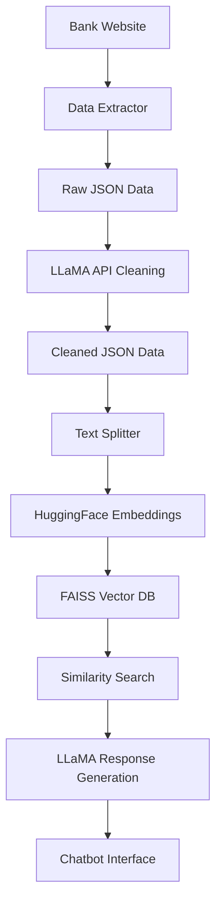

# Bank of Maharashtra Loan Information Chatbot

[](https://python.org)
[](https://langchain.com)
[](https://github.com/facebookresearch/faiss)

A RAG (Retrieval-Augmented Generation) based chatbot that extracts loan information from Bank of Maharashtra's website and provides intelligent responses to user queries about various loan products.

## 🚀 Features

- **Web Scraping**: Automatically extracts loan information from Bank of Maharashtra's website
- **Data Processing**: Cleans and structures the extracted data using LLaMA API
- **Vector Database**: Creates FAISS index for efficient similarity search
- **Interactive Chat**: Command-line chatbot interface for querying loan information
- **Multi-tab Data Extraction**: Extracts information from various sections like Features & Benefits, Documents Required, Interest Rates, EMI Calculator, and Eligibility

## 📁 Project Structure

```
bank-loan-chatbot/
├── data/
│   ├── faiss_index/           # FAISS vector database files
│   ├── mah_bank_raw_loan_data.json      # Raw scraped data
│   └── mah_bank_cleaned_loan_data.json  # Processed and cleaned data
├── data_extractor.py          # Web scraping and data extraction
├── faiss_indexer.py          # Vector database creation
├── inference.py              # Chatbot interface
└── README.md
```

## 🛠️ Installation

### Prerequisites

- Python 3.8+
- Chrome browser (for Selenium)
- ChromeDriver

### Dependencies

Create a virtual environment and install the required packages:

```bash
# Create virtual environment
python -m venv venv

# Activate virtual environment
# On Windows:
venv\Scripts\activate
# On macOS/Linux:
source venv/bin/activate

# Install dependencies
pip install -r requirements.txt
```

**requirements.txt:**
```txt
selenium==4.15.0
beautifulsoup4==4.12.2
requests==2.31.0
tqdm==4.66.1
langchain==0.1.0
langchain-community==0.0.10
faiss-cpu==1.7.4
sentence-transformers==2.2.2
lxml==4.9.3
```

### Environment Setup

1. **NVIDIA API Token**: Get your API token from NVIDIA's API service
2. **Update the token** in both `data_extractor.py` and `inference.py`:
   ```python
   LLAMA_ACCESS_TOKEN = "your-nvidia-api-token"
   ```

## 🔧 Usage

### Step 1: Data Extraction

Extract loan information from the Bank of Maharashtra website:

```bash
python data_extractor.py
```

This script will:
- Scrape the bank's sitemap for loan-related URLs
- Extract data from various loan product pages
- Clean and structure the data using LLaMA API
- Save raw and cleaned data as JSON files

### Step 2: Create Vector Index

Build the FAISS vector database:

```bash
python faiss_indexer.py
```

This will:
- Load the cleaned loan data
- Split text into chunks
- Create embeddings using HuggingFace models
- Build and save the FAISS index

### Step 3: Start the Chatbot

Launch the interactive chatbot:

```bash
python inference.py
```

## 📸 Screenshots

### Chatbot Interaction
```
$ python inference.py
question : What documents are required for home loan?
answer: For a home loan application, you need to provide income proof documents like salary slips, 
bank statements, identity proof such as PAN card or Aadhaar card, address proof, property 
documents, and employment verification letters. Additional documents may be required based on 
your employment type and loan amount.

question : What is the interest rate for personal loans?
answer: Personal loan interest rates typically range from 10.50% to 24% per annum, depending 
on your credit profile, income, employment stability, and loan amount. The exact rate will be 
determined after evaluating your application and credit score.

question : exit
Thank you!! 
Terminating Chat Agent
```

## 📊 Architecture Overview



## 📋 Features Extracted

The system extracts information from the following sections:

- **Features & Benefits**: Key features and advantages of loan products
- **Documents Required**: List of necessary documents for loan application
- **Interest Rates**: Current interest rates and rate structures
- **EMI Calculator**: EMI calculation details and examples
- **Eligibility**: Eligibility criteria and requirements

## 🔧 Configuration

### Environment Variables

Create a `.env` file in the project root:

```env
NVIDIA_API_TOKEN=your-nvidia-api-token-here
```

### Chrome Options
The scraper uses headless Chrome with optimized settings for reliable data extraction:

```python
CHROME_OPTIONS = Options()
CHROME_OPTIONS.add_argument("--headless=new")
CHROME_OPTIONS.add_argument("--disable-gpu")
CHROME_OPTIONS.add_argument("--no-sandbox")
CHROME_OPTIONS.add_argument("--disable-dev-shm-usage")
```

### Text Splitting Configuration
```python
splitter = RecursiveCharacterTextSplitter(
    chunk_size=1000,        # Maximum chunk size
    chunk_overlap=200       # Overlap between chunks
)
```

### LLaMA API Settings
```python
payload = {
    "model": "meta/llama-3.3-70b-instruct",
    "max_tokens": 1000,
    "temperature": 1.0,
    "top_p": 1.0
}
```

## 🚨 Important Notes

### Security
- **API Token**: Store your NVIDIA API token in environment variables, never commit to version control
- **Rate Limits**: Be mindful of API rate limits when processing large amounts of data
- **.gitignore**: Add the following to your `.gitignore` file:
  ```gitignore
  .env
  data/*.json
  __pycache__/
  *.pyc
  venv/
  .DS_Store
  ```

### Web Scraping Ethics
- **Robots.txt**: Respect the website's robots.txt file
- **Rate Limiting**: Implement delays between requests to avoid overwhelming the server
- **Terms of Service**: Ensure compliance with the bank's terms of service

### Technical Requirements
- **Chrome Driver**: Ensure ChromeDriver is compatible with your Chrome browser version
- **Memory**: FAISS indexing may require significant RAM for large datasets
- **Internet**: Stable internet connection required for web scraping and API calls

## 🛡️ Error Handling

The system includes comprehensive error handling for:
- Network timeouts and connection issues
- Missing web elements during scraping
- API call failures
- JSON parsing errors
- File I/O operations

## 📊 Data Flow

1. **Extraction** → Web scraping → Raw JSON data
2. **Cleaning** → LLaMA API processing → Cleaned JSON data
3. **Indexing** → Text splitting → Vector embeddings → FAISS index
4. **Inference** → User query → Similarity search → LLaMA response

## 🤝 Contributing

We welcome contributions! Please follow these steps:

### Development Setup

```bash
# Clone the repository
git clone https://github.com/devendrasathaye/MB_RAG_MODEL.git
cd MB_RAG_MODEL

# Install development dependencies
pip install -r requirements.txt

# Run Data extractor
python data_extractor.py

# Run FAISS index
python faiss_indexer.py

# Run Inference
python inference.py
```

## ⚠️ Disclaimer

This tool is designed for informational purposes only. Always verify loan information directly with Bank of Maharashtra before making financial decisions. The accuracy of extracted information depends on the source website's current content.

## 🐛 Known Issues

- **Issue #1**: Some pages may not load completely in headless mode
  - **Workaround**: Increase page load timeout or disable headless mode
- **Issue #2**: API rate limiting during bulk processing
  - **Workaround**: Implement exponential backoff strategy
